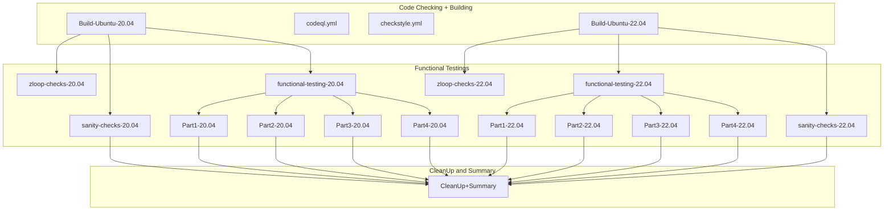

## The testings are done this way

1) build zfs modules for Ubuntu 20.04 and 22.04 (~15m)
2) 2x zloop test (~10m) + 2x sanity test (~25m)
3) 4x functional testings in parts 1..4 (each ~1h)
4) cleanup and create summary
   - content of summary depends on the results of the steps

When everything runs fine, the full run should be done in
about 2 hours.

The codeql.yml and checkstyle.yml are not part in this circle.
