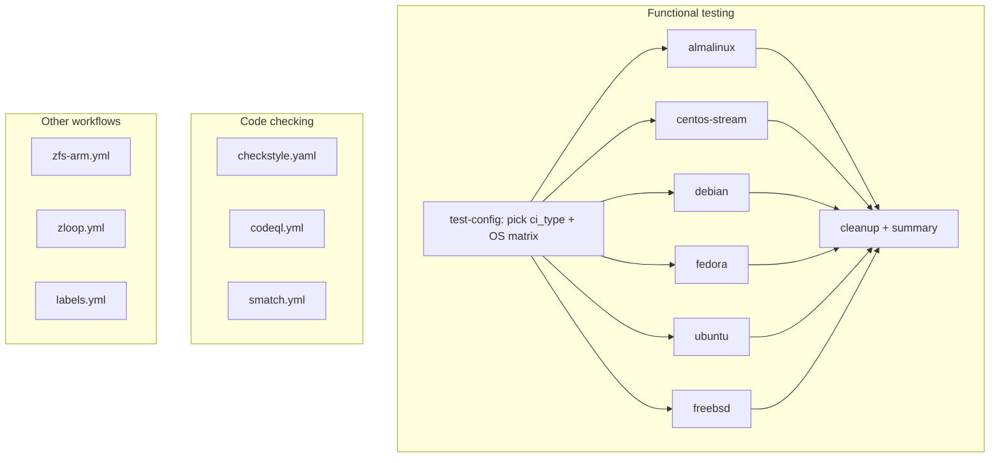

## CI overview

The main test pipeline is `zfs-qemu.yml`. Code checking and other
workflows run independently alongside it.

```mermaid
flowchart TB
subgraph Functional testing
  Setup[test-config: pick ci_type + OS matrix]
  Setup --> almalinux
  Setup --> centos[centos-stream]
  Setup --> debian
  Setup --> fedora
  Setup --> ubuntu
  Setup --> freebsd
  almalinux --> Cleanup[cleanup + summary]
  centos --> Cleanup
  debian --> Cleanup
  fedora --> Cleanup
  ubuntu --> Cleanup
  freebsd --> Cleanup
end

subgraph Code checking
  checkstyle.yaml
  codeql.yml
  smatch.yml
end

subgraph Other workflows
  zfs-arm.yml
  zloop.yml
  labels.yml
end
```

Every `qemu-vm` matrix entry runs on a fixed `ubuntu-24.04` host.
The steps inside one entry are:

1) set up QEMU and boot the guest (~2-4m)
2) install build dependencies in the guest (~2-4m)
3) build zfs modules in the guest (~8-12m)
4) run functional tests (~2-4h)
5) package and upload per-OS test logs (~10s)

A per-OS entry takes about 3 to 4 hours. Once all entries finish, the
`cleanup` job aggregates the results into a summary.

### `ci_type` selection

`test-config` runs `.github/workflows/scripts/generate-ci-type.py` against
the PR's changed files and picks one of:

| `ci_type` | OS matrix                                  |
|-----------|--------------------------------------------|
| `docs`    | empty (documentation-only PRs)             |
| `quick`   | 6 Linux + 1 FreeBSD                        |
| `linux`   | all supported Linux distros                |
| `freebsd` | all supported FreeBSD versions             |
| default   | cross-platform sample                      |

Pushes to `openzfs/zfs` skip the matrix entirely; only PRs (and pushes to
forks) build.

Authors can force a specific ci_type by adding `ZFS-CI-Type: <type>` to
the most recent commit message. The `ZTS_OS_OVERRIDE` repository variable
can also alter the selection. The `workflow_dispatch` trigger accepts
`fedora_kernel_ver` (Fedora-only run with a chosen kernel) and
`specific_os` (pin the matrix to one OS).

### Supported guests

Auto-selected:

- Linux: almalinux 8/9/10, centos-stream 9/10, debian 11/12/13,
  fedora 43/44, ubuntu 22/24/26
- FreeBSD: 14.4-RELEASE/STABLE, 15.0-RELEASE, 15.1-STABLE, 16.0-CURRENT

Available via `specific_os` or `ZTS_OS_OVERRIDE`:

- archlinux, tumbleweed

### Code checking

- `checkstyle.yaml`: source-style checks
- `codeql.yml`: CodeQL analysis
- `smatch.yml`: smatch analysis

### Other workflows

- `zfs-arm.yml`: ARM build on `ubuntu-24.04-arm`
- `zloop.yml`: host-side zloop
- `labels.yml`: maintains PR status labels
- `zfs-qemu-packages.yml`: manually dispatched, builds release RPMs or
  tests RPM installation from the ZFS yum repo
